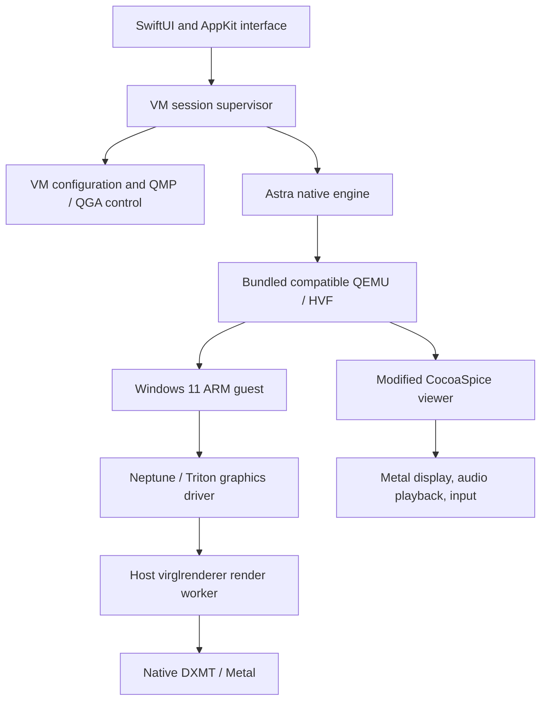

# Architecture

The runtime is loaded relative to the complete app bundle. End users of an accepted complete app need no installed UTM. Its first accepted runtime import used compatible UTM 5.0.5 (124) components, so a generic QEMU replacement is not interchangeable with the graphics ABI.

QMP controls the VM engine; QGA talks to Windows' guest-control service. They use separate serialized clients with bounded deadlines. Guest-agent synchronization precedes control requests. A sent shutdown request is not proof that Windows has stopped.

Input generations cancel stale queued work when capture ends or the app loses focus. The host viewer uses output-only audio playback and relative mouse capture. Text clipboard sharing has a per-VM opt-in, foreground checks, size/type limits, and echo suppression. Clipboard contents are not logged.

Each selected machine owns its disk, firmware variables, TPM state, UUID, and configuration. The interface currently supports one active VM. Accepted binaries and source experiments are tracked separately; source reconstruction does not itself establish runtime qualification.
